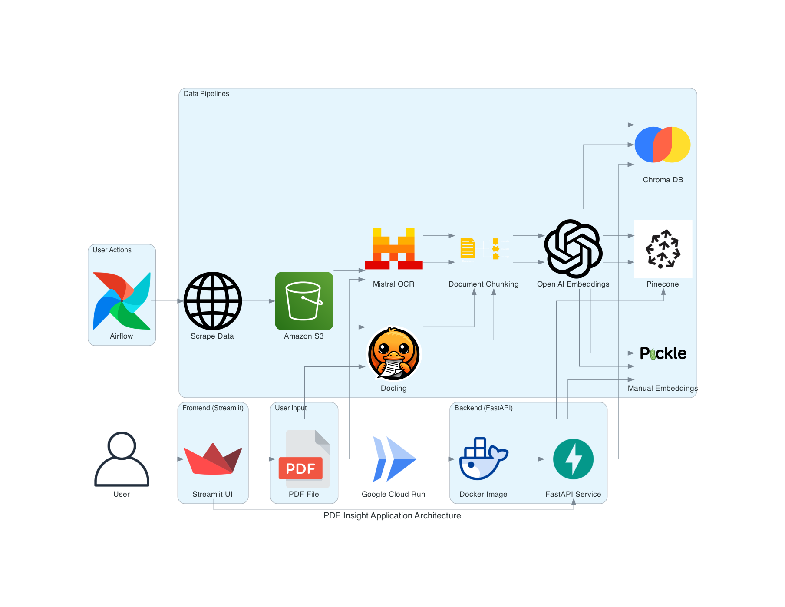

# DAMG7245_Assignment04_Part02

## Project Overview

The project focuses on designing an AI-powered information retrieval system that automates the extraction, processing, and analysis of financial reports. Using **Apache Airflow**, the system orchestrates the retrieval of NVIDIA’s quarterly financial statements, processes them with advanced text extraction methods, and stores the data efficiently for querying. The project incorporates **multiple chunking techniques** to optimize data segmentation and **embeddings** to enhance retrieval performance. A **Streamlit-based UI** enables users to explore the dataset and upload their own documents for analysis, ensuring an interactive and customizable experience.

## Key Features

### **1. Automated Data Collection & Storage**

- **Scraping NVIDIA Reports**: Develops an automated workflow to extract the last five years of financial reports from NVIDIA’s official source.
- **Cloud Storage Integration**: Saves raw documents securely in **AWS S3** for scalable data management.

### **2. Intelligent Document Processing**

- **Advanced PDF Extraction**: Utilizes cutting-edge tools for parsing:
    - **Docling**: Extracts structured data efficiently.
    - **Mistral OCR**: Converts scanned PDFs into machine-readable text with high accuracy.
- **Data Segmentation Strategies**: Implements diverse methods to break down large text blocks:
    - **Logical Sectioning**: Divides text based on structured headers.
    - **Contextual Grouping**: Segments related content to maintain semantic meaning.
    - **Sliding Window Approach**: Ensures overlapping sections for better context retention.

### **3. Embeddings & Vector Storage for Efficient Retrieval**

- **Transforming Text into Embeddings**: Converts processed text into **OpenAI vector representations** for improved search accuracy.
- **Flexible Storage Options**:
    - **Pinecone**: Cloud-based vector database for rapid information retrieval.
    - **ChromaDB**: Local vector store optimized for AI-driven searches.
    - **Pickle Storage in S3**: Alternative manual storage for embedding representations.

### **4. Enhanced Search & Retrieval System**

- **Hybrid Query Processing**: Users can refine searches based on specific time periods to get precise insights.
- **Multiple Search Approaches**:
    - **Manual Vector Similarity Matching**: Computes similarity without external databases.
    - **Optimized Retrieval via Pinecone & ChromaDB**: Uses precomputed embeddings for real-time document querying.

### **5. Interactive Streamlit-Based User Interface**

- **Custom Document Uploads**: Users can analyze their own files using the same pipeline.
- **Flexible Processing Options**: Allows selection of:
    - Preferred **PDF extraction method** (Docling, Mistral OCR).
    - **Chunking technique** for optimal segmentation.
    - **Embedding storage method** (manual, Pinecone, ChromaDB).
    - **Specific quarter selection** for refined query responses.
- **Intelligent Response Generation**: Processes user queries using an integrated **language model** for relevant insights.

### **6. Scalable Deployment & Cloud Integration**

- **Containerized Infrastructure**:
    - **Airflow Workflow Container**: Automates ingestion, processing, and embedding generation.
    - **Streamlit & FastAPI Service**: Hosts the user interface and API for seamless interaction.
- **Cloud Hosting & Accessibility**: The application and backend services are deployed to ensure **scalability and reliability**.

## Resources

Application: 

Backend FastAPI: 

Airflow Endpoint: 

Google Codelab: [Codelab Link](https://codelabs-preview.appspot.com/?file_id=1wNuNnA158jJYUCYnTUqUbAgyzFWdDzevLy3CQaNrNlk/edit?tab=t.0#0)

Google Docs: [Google Docs](https://docs.google.com/document/d/1wNuNnA158jJYUCYnTUqUbAgyzFWdDzevLy3CQaNrNlk/edit?tab=t.0)

Video Walkthrough:

## Technologies Used

- **Streamlit**: Frontend Framework
- **FastAPI**: API Framework
- **Apache Airflow**: Data Pipeline Orchestration
- **Selenium**: Web Scraping
- **Docling**: PDF Document Data Extraction Tool
- **Mistral OCR**: PDF Document Data Extraction Tool
- **AWS S3**: External Cloud Storage
- **Pinecone**: Vector Database
- **ChromaDB**: Vector Database
- **OpenAI**: Retrieval-Augmented Generation
- **Google Cloud Run**: Backend Deployment
- **Google Compute Engine**: Airflow Deployment

## Application Workflow Diagram



### **Workflow**

1. **Data Ingestion**:
    - The system retrieves **NVIDIA quarterly financial reports** from the official website using a web scraping pipeline.
    - Extracted reports (PDFs) are stored securely in **AWS S3** for further processing.
    - Users can also **upload their own PDFs**, which are similarly stored in **S3**.
2. **Document Processing & Chunking**:
    - The selected document is parsed using **Docling** or **Mistral OCR**, extracting the text and converting it into structured data.
    - The extracted text undergoes **chunking** using different strategies:
        - **Markdown-based**: Splitting based on document sections.
        - **Semantic segmentation**: Grouping related text intelligently.
        - **Sliding window technique**: Overlapping text chunks for context preservation.
3. **Embedding Generation & Storage**:
    - Each processed chunk is **converted into OpenAI embeddings** for semantic search.
    - The embeddings are stored in:
        - **Pinecone** for cloud-based vector search.
        - **ChromaDB** for local vector indexing.
        - **AWS S3 (Pickle files)** as a manual storage alternative.
4. **Query Processing & Retrieval**:
    - Users interact with a **Streamlit application**, where they:
        - Select a **document** from the stored dataset.
        - Choose processing options such as **chunking method** and **vector storage**.
        - Submit a **query** related to the selected document.
    - The query request is sent to **FastAPI**, which determines the retrieval method based on user selection.
    - **Relevant document chunks** are retrieved using the appropriate storage method (Pinecone, ChromaDB, or manual similarity computation).
5. **Response Generation & Display**:
    - Retrieved chunks are passed to an **LLM**, which generates a relevant response.
    - The final output is sent back to the **Streamlit UI**, where users can view the extracted insights.

## **Data Flow & API Processes**

### **1. User Input**

Users provide input through the **Streamlit UI** or an API request, including:

- **PDF Uploads**: Users can upload a document for extraction and processing.
- **Query Requests**: Users can ask questions about NVIDIA reports or their own uploaded documents.

### **2. Frontend (Streamlit UI)**

The **Streamlit application** allows users to:

- Upload **new PDFs** for analysis.
- Select from existing **stored documents**.
- Choose processing parameters (PDF parser, chunking method, embedding storage).
- Submit queries and receive AI-generated responses.

### **3. Backend (FastAPI & Airflow)**

The **FastAPI backend** manages:

- **Document processing** by calling Airflow workflows.
- **Embedding retrieval** from Pinecone, ChromaDB, or manual similarity computation.
- **Query handling** and response generation.

**API Routes include:**

- **/upload_pdf** → Uploads and processes a document.
- **/process_document** → Parses, chunks, and stores embeddings.
- **/query_document** → Retrieves relevant content based on user queries.

### **4. Apache Airflow (Orchestration Engine)**

- **Airflow DAGs** automate data ingestion, processing, and storage.
- Ensures workflows run on demand.

### **5. Vector Storage & Retrieval**

The backend supports multiple storage options for embeddings:

- **Pinecone**: Cloud-based vector search.
- **ChromaDB**: Local vector database.
- **Manual Computation**: Uses cosine similarity on locally stored embeddings in **AWS S3 Pickle files**.

### **6. Query Execution & LLM Processing**

- User queries are processed by FastAPI, which fetches relevant document chunks from **vector storage**.
- The retrieved content is passed through an **LLM**, which generates a refined response.
- The response is returned to the **Streamlit UI** for display.

### **7. Deployment & Execution**

- **Airflow & FastAPI** run as Docker containers for modular and scalable deployment.
- **Streamlit UI** is hosted on a cloud platform for easy user access.
- **AWS S3** stores both raw PDFs and processed embeddings for retrieval.

## Installation Steps

```
Required Python Version 3.12.*
```

### 1. Cloning the Repository

```bash
git clone https://github.com/BigDataIA-Spring2025-4/DAMG7245_Assignment04_Part02.git
cd DAMG7245_Assignment04_Part02
```

### 2. Setting up the virtual environment

```bash
python -m venv venvsource venv/bin/activate
pip install -r requirements.txt
```

### 3. AWS S3 Setup

**Step 1: Create an AWS Account**

- Go to [AWS Signup](https://aws.amazon.com/) and click **Create an AWS Account**.
- Follow the instructions to enter your email, password, and billing details.
- Verify your identity and choose a support plan.

**Step 2: Log in to AWS Management Console**

- Visit [AWS Console](https://aws.amazon.com/console/) and log in with your credentials.
- Search for **S3** in the AWS services search bar and open it.

**Step 3: Create an S3 Bucket**

- Click **Create bucket**.
- Enter a unique **Bucket name**.
- Select a region closest to your users.
- Configure settings as needed (e.g., versioning, encryption).
- Click **Create bucket** to finalize.


